<div align="center">

<picture>
  <source media="(prefers-color-scheme: dark)" srcset="./banner-dark.svg">
  <source media="(prefers-color-scheme: light)" srcset="./banner-light.svg">
  
</picture>

<br><br>

<!-- engineering-orbit.svg is ~2.5MB — worth knowing it adds real weight
     to the README's initial load if that matters to you. Optimize
     (svgo) or downscale if load time becomes a concern. -->


<br><br>


</div>

---

<div align="center">

###  Connect

<a href="https://www.linkedin.com/in/arunmalve/" target="_blank"></a>&nbsp;&nbsp;
<a href="https://www.youtube.com/@gudshuis" target="_blank"></a>&nbsp;&nbsp;
<a href="https://www.instagram.com/malve_/" target="_blank"></a>&nbsp;&nbsp;
<a href="https://medium.com/@gudshuis" target="_blank"></a>

</div>

---

###  Stack

<!--
  Several simple-icons slugs used here (AWS, Azure, DynamoDB, SQS,
  LinkedIn, PowerShell, Azure DevOps) were removed from the current
  simple-icons registry (trademark takedowns / never added for niche
  tools). Those badges are rebuilt as inline base64 SVG data URIs
  pulled from the last simple-icons release that still had them
  (v9, via jsdelivr), recolored to fill="white" to match this badge
  style. Lacework, Nagios, Sysdig, Velero, SNS, and Azure Service Bus
  have no icon in any simple-icons release and stay text-only — that's
  a deliberate fallback, not a bug.
-->

<table align="center">
<tr><td align="center" colspan="2">

**AI / LLM**


</td></tr>
<tr><td align="center" colspan="2">

**Cloud**

<img src="https://img.shields.io/badge/AWS-39D353?style=flat-square&logo=data:image/svg%2bxml;base64,PHN2ZyBmaWxsPSJ3aGl0ZSIgZmlsbC1ydWxlPSJldmVub2RkIiB2aWV3Qm94PSIwIDAgMjQgMjQiIHhtbG5zPSJodHRwOi8vd3d3LnczLm9yZy8yMDAwL3N2ZyI+PHBhdGggZD0iTTYuNzYzIDEwLjAzNmMwIC4yOTYuMDMyLjUzNS4wODguNzEuMDY0LjE3Ni4xNDQuMzY4LjI1Ni41NzYuMDQuMDYzLjA1Ni4xMjcuMDU2LjE4MyAwIC4wOC0uMDQ4LjE2LS4xNTIuMjRsLS41MDMuMzM1YS4zODMuMzgzIDAgMCAxLS4yMDguMDcyYy0uMDggMC0uMTYtLjA0LS4yMzktLjExMmEyLjQ3IDIuNDcgMCAwIDEtLjI4Ny0uMzc1IDYuMTggNi4xOCAwIDAgMS0uMjQ4LS40NzFjLS42MjIuNzM0LTEuNDA1IDEuMTAxLTIuMzQ3IDEuMTAxLS42NyAwLTEuMjA1LS4xOTEtMS41OTYtLjU3NC0uMzkxLS4zODQtLjU5LS44OTQtLjU5LTEuNTMzIDAtLjY3OC4yMzktMS4yMy43MjYtMS42NDQuNDg3LS40MTUgMS4xMzMtLjYyMyAxLjk1NS0uNjIzLjI3MiAwIC41NTEuMDI0Ljg0Ni4wNjQuMjk2LjA0LjYuMTA0LjkxOC4xNzZ2LS41ODNjMC0uNjA3LS4xMjctMS4wMy0uMzc1LTEuMjc3LS4yNTUtLjI0OC0uNjg2LS4zNjctMS4zLS4zNjctLjI4IDAtLjU2OC4wMzEtLjg2My4xMDMtLjI5NS4wNzItLjU4My4xNi0uODYyLjI3MmEyLjI4NyAyLjI4NyAwIDAgMS0uMjguMTA0LjQ4OC40ODggMCAwIDEtLjEyNy4wMjNjLS4xMTIgMC0uMTY4LS4wOC0uMTY4LS4yNDd2LS4zOTFjMC0uMTI4LjAxNi0uMjI0LjA1Ni0uMjhhLjU5Ny41OTcgMCAwIDEgLjIyNC0uMTY3Yy4yNzktLjE0NC42MTQtLjI2NCAxLjAwNS0uMzZhNC44NCA0Ljg0IDAgMCAxIDEuMjQ2LS4xNTFjLjk1IDAgMS42NDQuMjE2IDIuMDkxLjY0Ny40MzkuNDMuNjYyIDEuMDg1LjY2MiAxLjk2M3YyLjU4NnptLTMuMjQgMS4yMTRjLjI2MyAwIC41MzQtLjA0OC44MjItLjE0NC4yODctLjA5Ni41NDMtLjI3MS43NTgtLjUxLjEyOC0uMTUyLjIyNC0uMzIuMjcyLS41MTIuMDQ3LS4xOTEuMDgtLjQyMy4wOC0uNjk0di0uMzM1YTYuNjYgNi42NiAwIDAgMC0uNzM1LS4xMzYgNi4wMiA2LjAyIDAgMCAwLS43NS0uMDQ4Yy0uNTM1IDAtLjkyNi4xMDQtMS4xOS4zMi0uMjYzLjIxNS0uMzkuNTE4LS4zOS45MTcgMCAuMzc1LjA5NS42NTUuMjk1Ljg0Ni4xOTEuMi40Ny4yOTYuODM4LjI5NnptNi40MS44NjJjLS4xNDQgMC0uMjQtLjAyNC0uMzA0LS4wOC0uMDY0LS4wNDgtLjEyLS4xNi0uMTY4LS4zMTFMNy41ODYgNS41NWExLjM5OCAxLjM5OCAwIDAgMS0uMDcyLS4zMmMwLS4xMjguMDY0LS4yLjE5MS0uMmguNzgzYy4xNTEgMCAuMjU1LjAyNS4zMS4wOC4wNjUuMDQ4LjExMy4xNi4xNi4zMTJsMS4zNDIgNS4yODQgMS4yNDUtNS4yODRjLjA0LS4xNi4wODgtLjI2NC4xNTEtLjMxMmEuNTQ5LjU0OSAwIDAgMSAuMzItLjA4aC42MzhjLjE1MiAwIC4yNTYuMDI1LjMyLjA4LjA2My4wNDguMTIuMTYuMTUxLjMxMmwxLjI2MSA1LjM0OCAxLjM4MS01LjM0OGMuMDQ4LS4xNi4xMDQtLjI2NC4xNi0uMzEyYS41Mi41MiAwIDAgMSAuMzExLS4wOGguNzQzYy4xMjcgMCAuMi4wNjUuMi4yIDAgLjA0LS4wMDkuMDgtLjAxNy4xMjhhMS4xMzcgMS4xMzcgMCAwIDEtLjA1Ni4ybC0xLjkyMyA2LjE3Yy0uMDQ4LjE2LS4xMDQuMjYzLS4xNjguMzExYS41MS41MSAwIDAgMS0uMzAzLjA4aC0uNjg3Yy0uMTUxIDAtLjI1NS0uMDI0LS4zMi0uMDgtLjA2My0uMDU2LS4xMTktLjE2LS4xNS0uMzJsLTEuMjM4LTUuMTQ4LTEuMjMgNS4xNGMtLjA0LjE2LS4wODcuMjY0LS4xNS4zMi0uMDY1LjA1Ni0uMTc3LjA4LS4zMi4wOHptMTAuMjU2LjIxNWMtLjQxNSAwLS44My0uMDQ4LTEuMjI5LS4xNDMtLjM5OS0uMDk2LS43MS0uMi0uOTE4LS4zMi0uMTI4LS4wNzEtLjIxNS0uMTUxLS4yNDctLjIyM2EuNTYzLjU2MyAwIDAgMS0uMDQ4LS4yMjR2LS40MDdjMC0uMTY3LjA2NC0uMjQ3LjE4My0uMjQ3LjA0OCAwIC4wOTYuMDA4LjE0NC4wMjQuMDQ4LjAxNi4xMi4wNDguMi4wOC4yNzEuMTIuNTY2LjIxNS44NzguMjc5LjMxOS4wNjQuNjMuMDk2Ljk1LjA5Ni41MDIgMCAuODk0LS4wODggMS4xNjUtLjI2NGEuODYuODYgMCAwIDAgLjQxNS0uNzU4Ljc3Ny43NzcgMCAwIDAtLjIxNS0uNTU5Yy0uMTQ0LS4xNTEtLjQxNi0uMjg3LS44MDctLjQxNWwtMS4xNTctLjM2Yy0uNTgzLS4xODMtMS4wMTQtLjQ1NC0xLjI3Ny0uODEzYTEuOTAyIDEuOTAyIDAgMCAxLS40LTEuMTU4YzAtLjMzNS4wNzMtLjYzLjIxNi0uODg2LjE0NC0uMjU1LjMzNS0uNDc5LjU3NS0uNjU0LjI0LS4xODQuNTEtLjMyLjgzLS40MTUuMzItLjA5Ni42NTUtLjEzNiAxLjAwNi0uMTM2LjE3NSAwIC4zNTkuMDA4LjUzNS4wMzIuMTgzLjAyNC4zNS4wNTYuNTE4LjA4OC4xNi4wNC4zMTIuMDguNDU1LjEyNy4xNDQuMDQ4LjI1Ni4wOTYuMzM2LjE0NGEuNjkuNjkgMCAwIDEgLjI0LjIuNDMuNDMgMCAwIDEgLjA3MS4yNjN2LjM3NWMwIC4xNjgtLjA2NC4yNTYtLjE4NC4yNTZhLjgzLjgzIDAgMCAxLS4zMDMtLjA5NiAzLjY1MiAzLjY1MiAwIDAgMC0xLjUzMi0uMzExYy0uNDU1IDAtLjgxNS4wNzEtMS4wNjIuMjIzLS4yNDguMTUyLS4zNzUuMzgzLS4zNzUuNzEgMCAuMjI0LjA4LjQxNi4yNC41NjcuMTU5LjE1Mi40NTQuMzA0Ljg3Ny40NGwxLjEzNC4zNThjLjU3NC4xODQuOTkuNDQgMS4yMzcuNzY3LjI0Ny4zMjcuMzY3LjcwMi4zNjcgMS4xMTcgMCAuMzQzLS4wNzIuNjU1LS4yMDcuOTI2LS4xNDQuMjcyLS4zMzYuNTExLS41ODMuNzAzLS4yNDguMi0uNTQzLjM0My0uODg2LjQ0Ny0uMzYuMTExLS43MzQuMTY3LTEuMTQyLjE2N3pNMjEuNjk4IDE2LjIwN2MtMi42MjYgMS45NC02LjQ0MiAyLjk2OS05LjcyMiAyLjk2OS00LjU5OCAwLTguNzQtMS43LTExLjg3LTQuNTI2LS4yNDctLjIyMy0uMDI0LS41MjcuMjcyLS4zNTEgMy4zODQgMS45NjMgNy41NTkgMy4xNTMgMTEuODc3IDMuMTUzIDIuOTE0IDAgNi4xMTQtLjYwNyA5LjA2LTEuODUyLjQzOS0uMi44MTQuMjg3LjM4My42MDd6TTIyLjc5MiAxNC45NjFjLS4zMzYtLjQzLTIuMjItLjIwNy0zLjA3NC0uMTAzLS4yNTUuMDMyLS4yOTUtLjE5Mi0uMDYzLS4zNiAxLjUtMS4wNTMgMy45NjctLjc1IDQuMjU0LS4zOTkuMjg3LjM2LS4wOCAyLjgyNi0xLjQ4NSA0LjAwNy0uMjE1LjE4NC0uNDIzLjA4OC0uMzI3LS4xNTEuMzItLjc5IDEuMDMtMi41Ny42OTUtMi45OTR6Ii8+PC9zdmc+&logoColor=white" alt="AWS">


</td></tr>
<tr><td align="center" colspan="2">

**Platform / Infra**


</td></tr>
<tr><td align="center" colspan="2">

**CI/CD**


</td></tr>
<tr><td align="center" colspan="2">

**Security**


</td></tr>
<tr><td align="center" colspan="2">

**Observability**


</td></tr>
<tr><td align="center" colspan="2">

**Messaging / Streaming**


</td></tr>
<tr><td align="center" colspan="2">

**Data**


</td></tr>
<tr><td align="center" colspan="2">

**Languages / Scripting**


</td></tr>
</table>

---

###  Projects

<details open>
<summary><b>Homelab AI-Ops Platform — Proxmox + Kubernetes + AI Agent</b></summary>

<br>

A 39-component self-hosted platform built from bare Proxmox VMs to a full
production-shaped Kubernetes stack: GitOps delivery, secrets management,
observability, runtime security, and a RAG-backed AI agent, run as a
personal reliability/cost-optimization lab that mirrors real enterprise
platform-engineering practice.

| | |
|---|---|
| **Stack** |  Kubernetes ·  Proxmox ·  Argo CD ·  Terraform ·  HashiCorp Vault · External Secrets Operator · Cilium/Flannel ·  Istio |
| **Scale** | 3-node cluster, 39 tracked components across GitOps, storage, security, and AI serving layers |
| **Performance** | Prometheus + Grafana + Loki observability stack; KEDA event-driven autoscaling |
| **Security** | Kyverno policy-as-code, Falco runtime detection, Trivy vulnerability scanning, Vault-backed secrets, default-deny NetworkPolicy baseline |
| **Impact** | End-to-end platform used to validate real GitOps/DevSecOps patterns (progressive delivery, backup/restore via Velero, RAG-based AI agent serving) before applying them professionally |
| **Repository** | Private — available on request |

</details>

<!-- TODO: add further project cards in the same <details> format —
     name, description, Stack/Scale/Performance/Security/Impact/Repository
     table, and a professional explanation paragraph. -->

---

###  GitHub Analytics

<div align="center">


</div>

> `hide_rank=true` is intentional — GitHub's star-weighted rank skews
> against newer accounts regardless of actual contribution quality.

---

###  Contribution Activity

<div align="center">


</div>

---

###  Contribution Snake

<div align="center">

<picture>
  <source media="(prefers-color-scheme: dark)" srcset="https://raw.githubusercontent.com/gudshuis/gudshuis/output/snake-dark.svg">
  <source media="(prefers-color-scheme: light)" srcset="https://raw.githubusercontent.com/gudshuis/gudshuis/output/snake-light.svg">
  
</picture>

</div>

> Renders after `.github/workflows/snake.yml` runs once (Actions tab →
> Generate contribution snake → Run workflow) — the `output` branch
> doesn't exist before that.

---

###  Current Focus

```yaml
Learning:
  - Advanced multi-agent orchestration (MCP, RAG pipelines)
  - Kubernetes security hardening at scale
Building:
  - A 39-component homelab AI-Ops platform (Proxmox + Kubernetes)
Exploring:
  - OpenShift on bare-metal / hybrid cloud patterns
  - FinOps and cost-optimization tooling
Open To:
  - Senior Cloud / Platform / DevSecOps / AI Engineering roles
  - Conversations on GitOps, observability, and AI infrastructure
```

